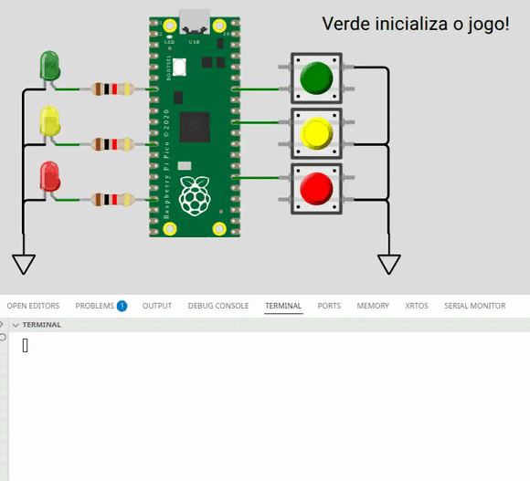

# EXE1

> [!WARNING]  
> Exercício com avaliação manual, não tem teste no wokwi! Mas possui testes de qualidade de código e de rubrica!

O objetivo é desenvolver um **firmware** que implemente um **jogo de memória e reflexo**, inspirado no *Genius* clássico, mas com **sequência fixa**.
O jogador deve **memorizar e repetir** a sequência exibida pelos LEDs, apertando os botões correspondentes **na mesma ordem**.

A cada rodada, a sequência mostrada aumenta em 1 passo — até um total de 10 cores.



## Regras do Jogo

1. **Início**

O jogo é iniciado pelo **botão verde**.


2. **Sequência de Cores (fixa, com 10 passos):**

A mesma sequência deve ser usada sempre (não aleatória):

```
🟡, 🟢, 🔴, 🟡, 🟢, 🟡, 🔴, 🟡, 🟢, 🟡
```

3. **Dinâmica do Jogo**

* O jogo exibe uma **sequência cumulativa** de cores, começando com apenas uma.
* Após mostrar as cores, o jogador deve **repeti-las na mesma ordem**, apertando os botões correspondentes.
* Se acertar toda a sequência atual, o jogo avança e mostra a mesma sequência com +1 cor.
* Se errar qualquer botão, o jogo termina.

Exemplo:

```
Rodada 1 → 🟢
Rodada 2 → 🟢 🟡
Rodada 3 → 🟢 🟡 🔴
...
```

4. **Temporização**

* Cada LED deve permanecer **aceso por 300 ms**.
* Após apagar, há um intervalo de **300 ms** antes da próxima cor.

5. **Pontuação**

* A pontuação é o **número máximo de rodadas completadas** com sucesso (de 1 a 10).
* Ao final do jogo, deve ser exibida a pontuação no formato **exato** a seguir:

```c
printf("Points %d\n", pnts);
```

> ⚠️ Use exatamente este formato para que o teste automático funcione.


## Detalhes do Firmware

* Implementação **baremetal** (sem RTOS).
* O sistema deve usar **interrupções nos botões**.
* **Não é permitido usar `gpio_get()`.**

## Testes

O código deve passar em todos os testes para ser avaliado em funcionalidade:

- `embedded_check`
- `firmware_check`
- ~~wokwi~~
