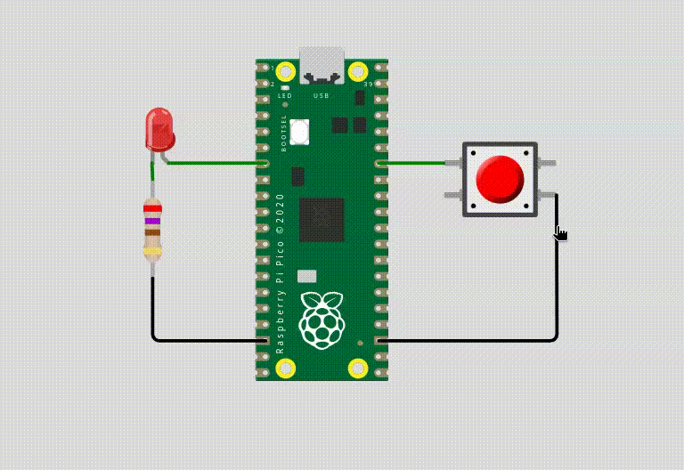

# EXE2

Neste exercício, vocês utilizarão o periférico de timer para piscar o LED. O tempo em que o LED permanecerá piscando será determinado pelo tempo em que o botão vermelho for mantido pressionado.

Sempre que o botão vermelho for pressionado, o tempo de pisca do LED vermelho deverá ser atualizado.

**Detalhes de funcionalidade:**

- Contabilizar o tempo que o botão vermelho se mantém pressionado.
- Manter o LED piscando com o tempo que o botão foi pressionado.
- O LED deve apagar sempre que o botão estiver pressionado.

**Detalhes do firmware:**

- Baremetal (sem RTOS).
- Deve trabalhar com interrupções nos botões.  
- Deve trabalhar com TIMER.
- Não é permitido usar `sleep_ms(), sleep_us()`.
- O LED não deve piscar enquanto o botão estiver sendo pressionado.
- **printf** pode atrapalhar o tempo de simulação, comenta/remova antes de testar.