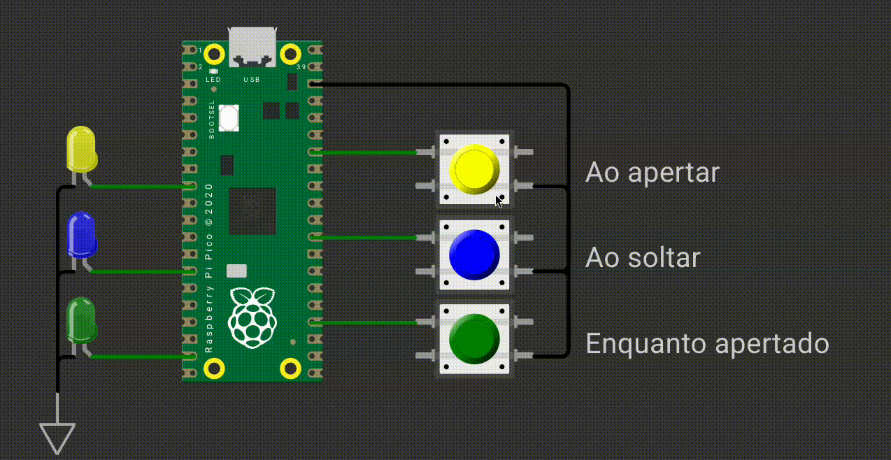

# EXE1

Neste exercício, você deve desenvolver um firmware que faz os LEDs piscarem, cada LED é controlado por um botão na respectiva cor, e cada botão deve funcionar da seguinte maneira:

- `AMARELO`: Ativar / Desativar ao **apertar** o botão
- `AZUL`: Ativar / Desativar ao **soltar** o botão
- `VERDE`: Ativado enquanto **apertado** e desativado quando **solto**.

Observações:

- Ativar = LED PISCANDO a cada 200ms
- Desativar = LED APAGADO
- **Os LEDs devem piscar juntos na mesma frequência e sincronizados!**

## Detalhes do firmware:

- Baremetal (sem RTOS).
- Usar delay de 200ms, caso contrário pode falhar no wokwi!
- Deve passar nos testes `embedded_check`, `cpp_check` e `rubric_check`.
- Deve trabalhar com interrupções nos botões.  
- Não é permitido usar `gpio_get()`.
- Não é permitido usar nenhum **timer!!**.

## Testes

O código deve passar em todos os testes para ser aceito:

- `embedded_check`
- `firmware_check`
- `wokwi`

Caso acredite que o seu código está funcionando, porém os testes estão falhando, preencha o forms:

[Google forms para revisão manual](https://docs.google.com/forms/d/e/1FAIpQLSdikhET4iqFwkOKmgD-G6Ri-2kCdhDLndlFWXdfdcuDfPnYHw/viewform?usp=dialog)
