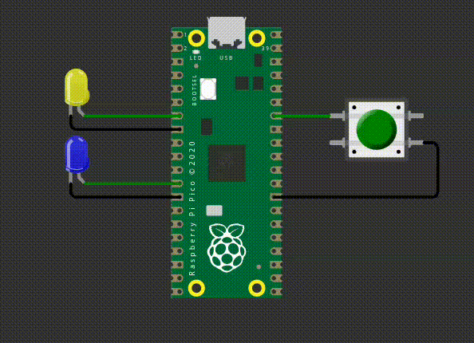

# EXE2

Neste exercício, você deve utilizar o periférico de **timer** para controlar dois LEDs. O funiconamento esperado é o seguinte:

- Os leds devem piscar somente quando o botão for pressionado.
- Eles devem piscar por 5 segundos, depois devem parar de piscar automaticamente. 

O período que cada LED deve piscar é:

- Led amarelo: 500ms
- Led azul: 150ms

**Regras de implementação do firmware:**

- Baremetal (sem RTOS).
- utilizar exatamente **`3`** timers independentes:
    - Um para o LED amarelo;
    - Um para o LED Azul;
    - Um para o alarme que irá contar 5 segundos.
- Os leds devem parar de piscar apagados.
- Deve trabalhar com interrupções nos botões.  
- Não é permitido usar `sleep_ms(), sleep_us(), get_absolute_time()`.
- **printf** pode atrapalhar o tempo de simulação, comenta/remova antes de testar.

## Testes

O código deve passar em todos os testes para ser aceito:

- `embedded_check`
- `firmware_check`
- `wokwi`

Caso acredite que o seu código está funcionando, porém os testes estão falhando, preencha o forms:

[Google forms para revisão manual](https://docs.google.com/forms/d/e/1FAIpQLSdikhET4iqFwkOKmgD-G6Ri-2kCdhDLndlFWXdfdcuDfPnYHw/viewform?usp=dialog)
