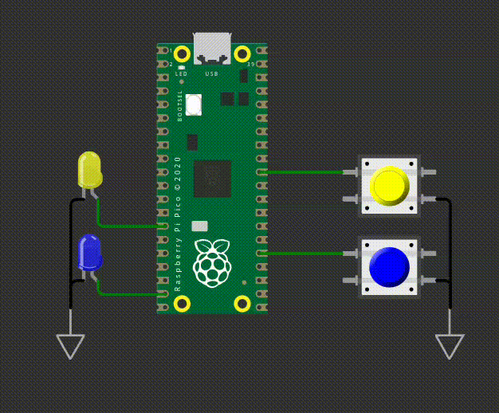

# EXE2

Neste exercício, você deve utilizar o periférico de **timer** para controlar dois LEDs. O funiconamento esperado é o seguinte:

- Ao apertar o **botão amarelo**, o **LED amarelo** pisca primeiro por 1s, e depois automaticamente o **LED azul** pisca por 2s.
- Ao apertar o **botão azul**, o **LED azul** pisca primeiro por 2s, e depois automaticamente o **LED amarelo** pisca por 1s.

Os LEDs devem piscar da seguinte maneira:

- Led amarelo:
    - freq: 5Hz
    - período: 1s

- Led amarelo:
    - freq: 2Hz
    - período: 2s

Os LEDs devem todos pararem de piscar apagados!

## Regras de implementação do firmware:

- Baremetal (sem RTOS).
- Utilizar timers
- Os leds devem parar de piscar apagados.
- Deve trabalhar com interrupções nos botões.  
- Não é permitido usar `sleep_ms(), sleep_us(), get_absolute_time()`.
- **printf** pode atrapalhar o tempo de simulação, comenta/remova antes de testar.

## Testes

O código deve passar em todos os testes para ser aceito:

- `embedded_check`
- `firmware_check`
- `wokwi`

Caso acredite que o seu código está funcionando, porém os testes estão falhando, preencha o forms:

[Google forms para revisão manual](https://docs.google.com/forms/d/e/1FAIpQLSdikhET4iqFwkOKmgD-G6Ri-2kCdhDLndlFWXdfdcuDfPnYHw/viewform?usp=dialog)
