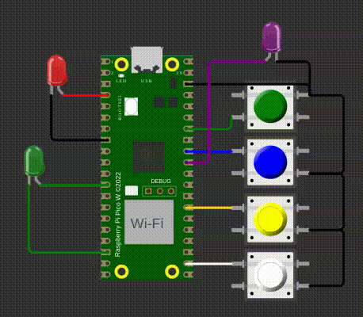
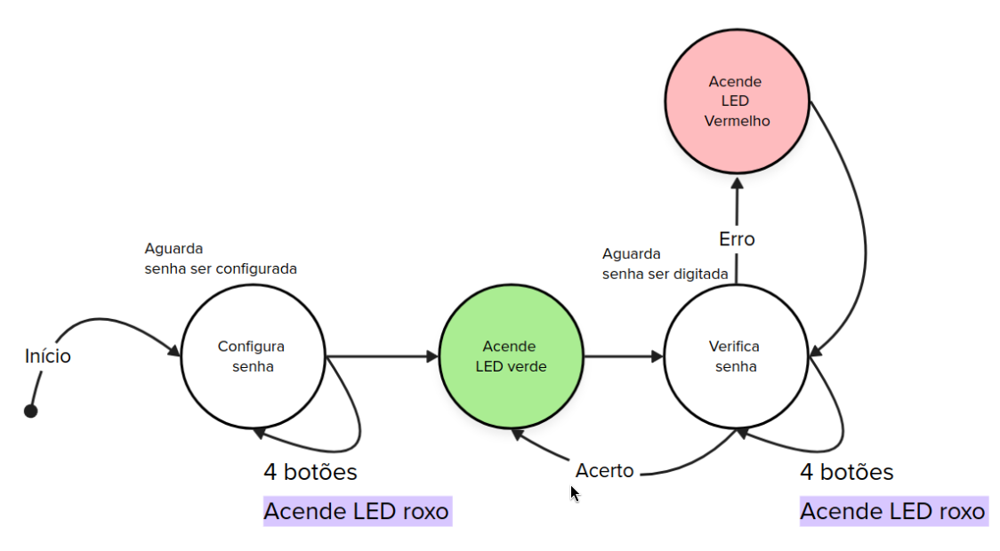

# EXE1

Neste exercício, você deve desenvolver um firmware que:

- Receba do usuário uma senha (combinação de botões pressionados).  
- Aguarde o usuário apertar os botões e verifique se a senha está correta.

**Detalhes de funcionalidade:**

- A senha deve ter tamanho 4.  
- O LED roxo deve acender sempre que qualquer botão for pressionado.  
- LED Verde: acender ao configurar uma senha ou ao acertar a senha.  
- LED Vermelho: acender sempre que a senha estiver incorreta.

**Detalhes do firmware:**

- Baremetal (sem RTOS)
- Deve trabalhar com interrupções nos botões.  
- Não é permitido usar `gpio_get()`.
- Os LEDs Verde e Vermelho devem permanecer acesos por 300 ms.
- Verificar apenas se a senha está certa ou errada após os 4 botões terem sidos pressionados.
- **printf** pode atrapalhar o tempo de simulação, comenta/remova antes de testar.