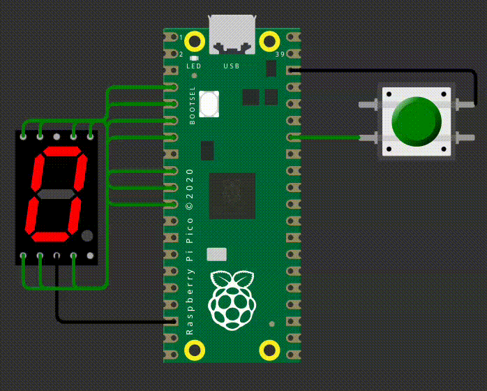

# EXE1

Neste exercício, você deve desenvolver um firmware que:

Possui as seguintes funções:
- `seven_seg_init()`: inicializa os pinos do display de sete segmentos
- `seven_seg_display(init val)`: Ao receber um valor inteiro de `0..9` exibe o mesmo no display

Toda vez que o botão for apertado vocês devem aumentar o valor que é exibido no display, ao chegar em 9 o contador deve ser zerado.

## Display de 7seg

Lembrem que o display de sete segmentos funciona da seguinte maneira:

## Detalhes do firmware:

- Baremetal (sem RTOS).
- Deve passar nos testes `embedded_check`, `cpp_check` e `rubric_check`.
- Deve trabalhar com interrupções nos botões.  
- Não é permitido usar `gpio_get()`.
- Deve implementar e usar as funções `seven_seg_init()`, `seven_seg_display(init val)`
