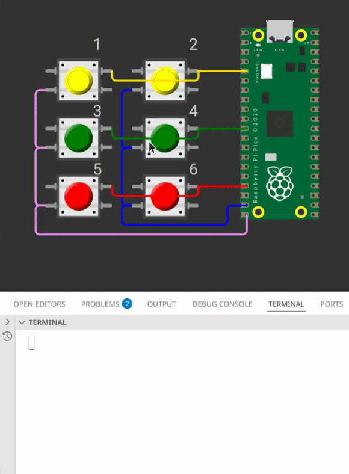

# EXE1

> [!WARNING]  
> Exercício com avaliação manual, não tem teste no wokwi! Mas possui testes de qualidade de código e de rubrica!



## Teclado Matricial

Um **teclado matricial** (ou *matrix keyboard*) é uma maneira eficiente de conectar vários botões a um microcontrolador — como **Arduino**, **ESP32** ou **Raspberry Pi**, utilizando bem menos pinos GPIO do que se cada botão fosse ligado individualmente.

Em vez de usar **um pino por botão**, os botões são organizados em uma **matriz** de **linhas e colunas**, o que permite reduzir drasticamente a quantidade de conexões necessárias, baratear a fabricação do teclado e minimizar o uso de pinos do microcontrolador.

Para uma matriz com **N linhas** e **M colunas**, você precisa de apenas **N + M pinos**, em vez de **N × M**.

### Estrutura da Matriz (Exemplo 3x2)

Imagine uma matriz com **3 linhas** e **2 colunas**, totalizando **6 botões**:

```
      C1   C2
L1   [ ]  [ ]
L2   [ ]  [ ]
L3   [ ]  [ ]
```

* As **linhas (L1, L2, L3)** e as **colunas (C1, C2)** são conectadas aos pinos digitais do microcontrolador.
* Cada botão está na **interseção** entre uma linha e uma coluna.
* Quando pressionado, o botão **conecta eletricamente** a linha correspondente à coluna correspondente.


### Como Fazer a Leitura (Varredura)

O processo para identificar qual botão foi pressionado é chamado de **varredura** (*scanning*), e segue estes passos:

1. **Configuração inicial:**

   * Defina as **linhas** como **saídas (OUTPUT)**.
   * Defina as **colunas** como **entradas (INPUT)** com **pull-up**.

(pode ser o contrário também)

2. **Energização (ativar uma linha por vez):**

   * Coloque **uma linha em nível HIGH** (tensão alta) e mantenha as outras em **LOW**.
   * Assim, apenas aquela linha está "ativa" no momento.

3. **Leitura das colunas:**

   * Verifique o estado de cada coluna.
   * Se uma coluna estiver em **nível HIGH**, significa que o botão na **interseção entre a linha ativa e essa coluna** foi pressionado.

4. **Repetição:**

   * Desative a linha atual, ative a próxima e repita o processo.
   * Fazendo isso rapidamente, o microcontrolador consegue detectar todos os botões pressionados.

### Vantagens

* Reduz o número de pinos necessários (N + M em vez de N × M).
* Fácil de expandir (basta adicionar linhas e colunas).
* Ideal para **teclados numéricos**, **painéis de controle** e **sistemas de menu**.

## Detalhes do Firmware

Imprimir no terminal o número do botão que foi pressionado.

* Implementação **baremetal** (sem RTOS).
* O sistema deve usar **interrupções nos botões**.
* **Não é permitido usar `gpio_get()`.**

## Testes

O código deve passar em todos os testes para ser avaliado em funcionalidade:

- `embedded_check`
- `firmware_check`
- ~~wokwi~~
